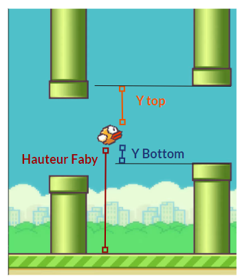
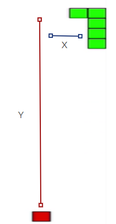
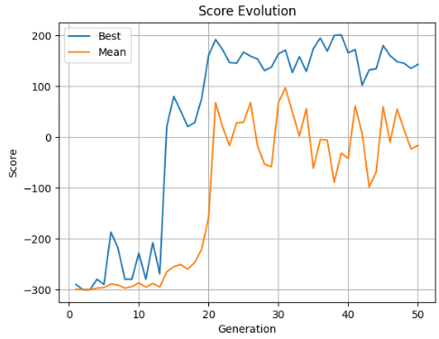
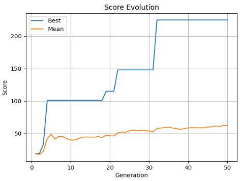
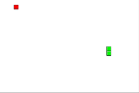
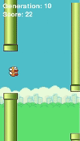

# 📖 Using **Genetic Algorithms** to Play **Snake** & **Flappy Bird** using **NEAT Algorithm**

This project demonstrates the use of the **NEAT (NeuroEvolution of Augmenting Topologies)** algorithm to create AI agents capable of playing and mastering two classic games: **Snake** and **Flappy Bird**. The NEAT algorithm evolves neural networks dynamically, making it an ideal solution for complex decision-making tasks like games.

 

## 🎮 Games Implemented

### Snake 🐍
A classic game where the goal is to control a growing snake, eat food, and avoid colliding with the walls or its own body.

### Flappy Bird 🐦
The objective of this game is to keep a bird flying through pipes by tapping the screen to make it flap. The bird must avoid crashing into the pipes.

 

## 🧠 How It Works

### NEAT Algorithm

**NEAT** is a type of genetic algorithm that evolves neural networks. Key aspects include:

- **Topology Evolution**: NEAT not only evolves the weights of the networks but also their architecture, meaning that the structure can grow over time.
- **Fitness Function**: A fitness function evaluates how well the AI performs in each game.
  - **Snake**: Fitness is based on the length of the snake and how long it survives.
  - **Flappy Bird**: Fitness is based on how long the bird survives and how many pipes it passes through.

### How NEAT Works:

- Each AI agent is represented by a **genome** that defines the structure of its neural network, including nodes, connections, and weights.
- The initial population starts with simple neural networks.
- Agents are evaluated based on their performance in the games, and the top performers are selected for the next generation.
- **Crossover**: Combines the genomes of selected individuals to form the next generation.
- **Mutation**: Structural changes such as adding or removing connections and nodes can occur.
- **Innovation**: New genes are tracked to maintain the diversity of networks and prevent stagnation.

 

### NEAT Configuration for Flappy Bird 🐦

- **Inputs**:
  - Bird Y position
  - Y distance to the top pipe
  - Y distance to the bottom pipe

- **Output**:
  - 1 to flap, 0 otherwise

- **Fitness**:
  - Based on the score (pipes passed)

- **Activation Function**: `TanH`
  

### NEAT Configuration for Snake 🐍

- **Inputs**:
  - Snake's direction
  - Horizontal distance to the food (X distance)
  - Vertical distance to the food (Y distance)

- **Outputs**:
  - 0: Up
  - 1: Down
  - 2: Left
  - 3: Right

- **Fitness**:
  - +10 for each food eaten, -1 per step taken

- **Activation Function**: `Sigmoid`
  

  
 

## 📊 Results

**Snake**: After several generations, the AI learns to avoid collisions and efficiently collect food.
  

  
**Flappy Bird**: The AI masters the timing needed to navigate between pipes and survive longer.
  

 

### Results in Action:

---

## 💻 Technologies

- **Python**: The programming language used to implement the algorithm and game logic.
- **Pygame**: Used to create the game environments for Snake and Flappy Bird.
- **NEAT-Python**: A Python library implementing the NEAT algorithm.

---

Feel free to explore, modify, and contribute to the project! 😊
